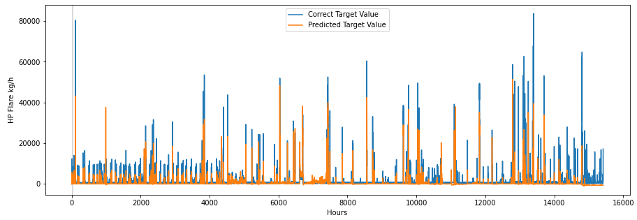

# Initial Integration of Data-Driven Health-Indicators In the Petroleum Industry

## Thesis Summay

Masters thesis in Engineering and ICT at the Norwegian University of Science and Technology. This thesis aims to take the initial step for integrating data-driven health-indicators for complex system in the Petroleum Industry. What followes is a highly abbreviated version of the thesis, and is summarized  below.  This thesis is written in collaboration with Teekay Offshore Production AS. 

## Abstract 

Condition monitoring has become a vital maintenance strategy across many industries. Obtaining information regarding health-condition of the system's components can profoundly reduce the operational costs as well as reduce the risk of catastrophic events. With today's emerging technology, it is possible to install sensors on every imaginable system component. Sensor technology generates a vast amount of data which, if interpreted correctly, leads to more insightful information. However, this does require sophisticated strategies regarding data acquisition, processing and advanced predictive techniques, as real-life data tends to be inconsistent, noisy and incomplete. This thesis proposes the initial step for implementing data-driven models to strengthen the predictive abilities in Teekay Offshore Production's maintenance strategy. A health-indicator for systems including compressors, turbines and diesel engines require a comprehensive data collection and might be too intricate to solve with the laws of physics. Thus, this thesis aims to research the possibility of using machine learning models to strengthen the predictive abilities of companies in the petroleum industry. Similar to most real-life datasets, the obtained data was of high dimension, complex structure and low quality. This thesis specifically focused on ensuring high data quality by performing an extensive grid-search through the domain of preprocessing techniques. The techniques were validated after their ability to improve the prediction accuracy, as the main objective of this thesis is to create an accurate health-indicator for a compression train. Three types of recurrent neural networks, alongside two baseline models, one classical statistical model and one multilayer perceptron, were created. The baseline models created the possibility of assessing the potential value of increasing the complexity of the models. The three recurrent neural networks outperformed both baseline models. The highest performing recurrent neural network was the Long-Short Term Memory with an increased performance of 17.18\% in terms of prediction accuracy. Finally, a hybrid model combining the strengths of the highest performing recurrent neural network and the classical autoregressive integrated moving average model was implemented. The hybrid model leveraged the strength of both individual models and obtained an increased performance of 27.51\% compared to the baseline models. A hybrid model achieved the best result in this research, as it captured both the linear and non-linear relationships in the real-life dataset. 


## Problem Area 

Since the production started in 2007, the Piranema unit has experienced a problem with its gas compression system. The FPSO extracts and processes the crude oil, which is later stored onboard the vessel. The gas extracted from the wells is later reinjected, in order to extract the remaining crude oil from the wells. In order for the gas injection to be effective, the injected natural gas needs to maintain a certain level of pressure. Increasing the pressure of the gas is done by compressing the gas through a three-stage compression train. The figure shows the positioning of the exhaust outlets for the OPRA turbines and the air inlets for the Solar Turbines. The OPRA turbines function as the primary power source on the FPSO and the Solar turbines power the shafts running the compression trains. Given a certain wind degree and wind speed, the exhaust from the OPRA turbines enters the air inlets of the Solar turbines. Polluted air entering the Solar inlets decreases the turbine function, resulting in reduced compression performance. By collecting historical sensory data from the FPSO, the scope of this thesis is to create a machine learning model that can indicate the future health state of the compression trains. The health indicator aims to predict the future performance for the compression trains. Predicting future performance creates the opportunity to execute preventive actions to avoid critical events such as process shutdowns.


 

## Data 

The data used in this thesis orignates from the gas compression train, the SOLAR Turbine, the OPRA Turbines, as well as weather data (wind speed, wind direction). 


# Construction of the Predictive Health-Indicator

### Libraries 

All models are written using Google Colab notebooks, which is an online cloud-based environment designed to train machine learning and deep learning models. It leverages the computational power of Google hardware with high performing GPUs\footnote{Graphics Processing Units}. The programming language is Python which yields the Numpy library used for multidimensional matrix operations. Additional libraries like Pandas and Matplotlib are used for data visualization and inspection. Tensorflow is an open-source machine learning platform provided by Google. It contains all the necessary tools and function to build a state-of-the-art machine learning model. 


## Architecture And Hyperparameters

### Recurrent Neural Network

|                | Simple RNN                   | GRU                         | LSTM                        |
| -------------- | ---------------------------- | --------------------------- | --------------------------- |
| Error Metric   | Root Mean Square Error       | Root Mean Square Error      | Root Mean Square Error      |
| Optimizer      | Root Mean Square Propagation | Adam                        | Adam                        |
| Learning Rate  | 0.001                        | 0.001                       | 0.001                       |
| Regularization | Dropout                      | Dropout                     | Dropout                     |
| Batch Size     | 740                          | 370                         | 370                         |
| Lookback       | 100                          | 200                         | 200                         |
| Callback       | CheckPoint & Early Stopping  | CheckPoint & Early Stopping | CheckPoint & Early Stopping |


|                     | Input Layer        | Hidden Layer 1     | Hidden Layer 2 | Output Layer |
| ------------------- | ------------------ | ------------------ | -------------- | ------------ |
| Number of Units     | 50                 | 50                 | 1              | 1            |
| Activation Function | Tangent Hyperbolic | Tangent Hyperbolic | Linear         | Leaky ReLU   |
| Dropout             | 0.3                | 0.3                | -              | -            |


### Multilayer Perceptron


### ARIMA 


### Hybrid Model 


#### Psuedo code for the Hybrid Model

```pseudocode
Algorithm 3 Hybrid Model 
Split the dataset into traning, validation and test set
Split the training set into n batches 
for each batch x do
	Perform prediction, Y with the ARIMA model 
	Transform x by inserting Y, yielding the new batch x'
end for 

for each epoch in the LSTM model do: 
	for each new bactch x' do 
	Train LSTM model
	Update Weight
	end for
	Perform predictions on the validation set
end for 

Perform predictions on the test set

```


## Results 

|                       | RMSE Score   | RMSE Score     | RMSE Score | Baseline Comparison | Baseline Comparison    |
| --------------------- | ------------ | -------------- | ---------- | ------------------- | ---------------------- |
|                       | Training Set | Validation Set | Test Set   | ARIMA               | Multilayer Perceptrion |
| Arima                 | 4999         | 4444           | 3893       | -                   | -6.78                  |
| MultiLayer Perceptron | 4541         | 4385           | 3629       | 6.78                | -                      |
| Simple RNN            | 4002         | 3408           | 3365       | 13.56               | 7.27                   |
| GRU                   | 4404         | 3394           | 3288       | 15.54               | 9.39                   |
| LSTM                  | 4146         | 3327           | 3224       | 17.18               | 11.16                  |
| Hybrid                | 3625         | 3417           | 2822       | 27.51               | 22.23                  |


All the recurrent neural networks have a higher performance than both of the baseline models. In the case of the ARIMA benchmark, the results state that neural networks, both recurrent and non-recurrent, have at least 6.78\% increased performance. This illustrates the effect of creating more complex models. In the case of the second benchmark, all the recurrent neural networks are outperforming the multi-layer perceptron by at least 7.27\%. That recurrent neural networks outperform the multi-layer perceptron model emphasizing the importance of leveraging past information and considering the time-series property of the dataset. Amongst the recurrent neural networks, the LSTM had the highest performance with an increased performance of 17.18\% compared to the ARIMA, and 11.16% compared to the multi-layer perceptron.

The performance of the hybrid model confirms our hypothesis of combining the strengths of classic statistical and machine learning methods. The average performance increased with 27.51% compared to the ARIMA and 22.23 % compared to the multi-layer perceptron. In addition, the performance increased with 12.45% compared to the highest performing recurrent neural network, the LSTM. 


#### Predicted vs. correct target values of LSTM Network 


#### Predicted vs. Correct target values Hybrid Model




#### Performance LSTM on normal condition 


#### Performance Hybrid Model on Normal Condition 


### Traning loss per epoch for each implemented model 


# Conclusion

The use of machine learning in condition-based monitoring is a field of study with great potential. Rapidly obtaining valuable information is beneficial in terms of competitive advantage, safety and sustainability. The increasing amount of available data creates the opportunity for companies to optimize their business strategies with precise predictive abilities. This thesis has explored the potential benefits of introducing machine learning in Teekay Offshore Production's maintenance strategy by creating a predictive health-indicator. We conducted a comprehensive review of the theory and literature regarding different approaches for implementing ML-models and preprocessing data when applied to the real-world domain. Creating an accurate health-indicator requires high-quality data and efficient data-driven models. Hence, the primary concern of this thesis has been to ensure high-quality data, as the obtained dataset was unstructured, inconsistent and noisy. The achievement of this goal required extensive experimental research in the preprocessing domain, in order to obtain the highest possible data quality. 
As the literature states,this was a time-consuming task, as it still does not exist a state-of-the-art pipeline of preprocessing techniques. By implementing several methods and validating the transformed dataset using a predictor, we were able to select the methods most suitable for our time-series. The importance of preprocessing is further confirmed when executing the optimized final model, which performed significantly better when fed preprocessed rather than raw data. We emphasize that these techniques can by no means ensure high-quality for another real-life dataset, as real-life data vary significantly in terms of quality, dimension and complexity. The implemented predictive models reflect state of the art within the field of ML with innovative solutions for inconsistent and sophisticated systems. Traditional time-series forecasting has been challenged by comparing classical statistical methods and recurrent neural networks. The LSTM significantly outperformed the baseline models with an increased performance of 17.18\%. Seeing that the literature emphasizes the advantages of hybrid models, we propose a predictive model which combines the strengths of the classical ARIMA and the LSTM. The hybrid model's predictive performance significantly outperforms the baseline models and RNNs with an increase of 27.5% and 12.45%, respectively. As real-life data is seldom purely linear or non-linear, it is natural that a model able to detect both relations performs better. 

The implemented models are proposed as the first initial integration of data-driven health-indicators. An accurate prediction of HP Flare can predict the future performance of the compression efficiency. This would yield useful information that the maintenance engineers can incorporate to avoid unwanted events such as a PSD trip. Reviewing the results, we argue that implementing ML in Teekay's maintenance strategy is worth the investment. However, this requires comprehensive restructuring regarding data allocation with a greater emphasis on ensuring reliable and consistent data. Having sensor data logged in one system, and unstructured data in another is the main obstacle Teekay needs to overcome, in order to follow the digital transformation. Several of the preprocessing steps required in this research can be replaced with a well-structured database, providing applicable data for real-time analysis. Embedding predictive strategies into the maintenance strategy yields more information that the engineers in Teekay can utilize in their daily operations and future planning. By reconstructing the database and introducing predictive strategies, the company's fundamental values can be strengthened, by optimizing all decisions considering people, planet and potential profit
